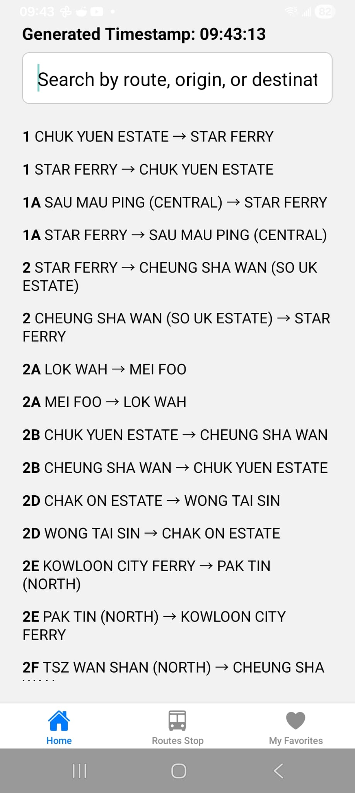
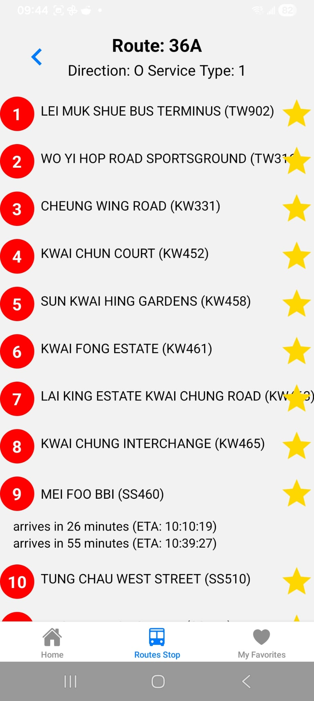
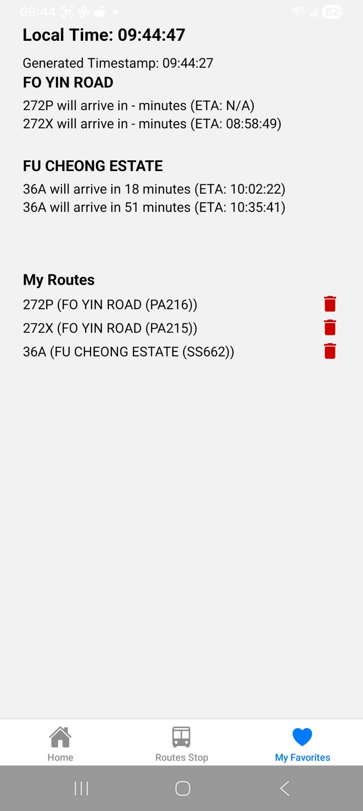

# :bus: Expo React Native Bus App

[](https://josefgst.github.io/android_bus_widget/)
[](https://josefgst.github.io/blog/2026/02/20/oncoming_bus-a-more-convenient-way-to-check-the-kmb-bus-arrival-time-hk/)

## Tech Stack

- Android
- React Native
- Expo

## :mag: Overview
A simple React Native app built with Expo, to fetch KMB bus arrival times and the ability to save favorite bus stops. The favorite bus stops are also displayed in an Android widget, which is the main advantage compared to other similar apps.

<div style="display: flex; gap: 16px;">
  
  
  
</div>

## Features
- Free and open source
- Save favorite bus stops
- Widget support for Android
- No annoying Ads
- Fast loading time

## 🛠️ Environment Setup
Required to build/run on Android, especially on a new machine:
- **Node.js & npm** — any reasonably recent version.
- **JDK 17** — required by Gradle for this project. A newer default JDK (e.g. JDK 21+) can break the build with a cryptic `Error resolving plugin [id: 'com.facebook.react.settings']` error, because the Kotlin Gradle DSL used here can't parse newer Java version strings. Install JDK 17 and either make it your system default, or point Gradle at it explicitly by adding to `android/gradle.properties`:
   ```properties
   org.gradle.java.home=/path/to/jdk-17
   ```
- **Android SDK** — install via Android Studio (simplest) or standalone `cmdline-tools`, including a platform, build-tools, and an NDK (this project builds native code for the widget). Set env vars, e.g. in `~/.bashrc`:
   ```bash
   export ANDROID_HOME=$HOME/Android/Sdk
   export PATH=$PATH:$ANDROID_HOME/platform-tools:$ANDROID_HOME/cmdline-tools/latest/bin
   ```
- **A device or emulator** — a physical device with USB debugging enabled, or an AVD created in Android Studio.

> ⚠️ Note: `android/` (and `ios/`) are gitignored and regenerated by `expo prebuild`. Any manual edits to `android/local.properties` or `android/gradle.properties` (like the `org.gradle.java.home` line above) don't survive a clean prebuild and need to be reapplied.

## 🚀 Getting Started
1. **📦 Install dependencies**
    ```bash
    npm install
    ```
2. **▶️ Run the app**
    - 🏁 Start Expo:
       ```bash
       npx expo start
       ```
    - 🤖 Run on Android:
       ```bash
       npx expo run:android
       ```
    - 🍏 Run on iOS (macOS required):
       ```bash
       npx expo run:ios
       ```
    - 🌐 Run on Web:
       ```bash
       npm run web
       ```

## 🏗️ Build & Deployment
1. **📦 Build Android release APK**
   ```bash
   npx expo run:android --variant release
   ```
2. **📲 Install APK on device**
   ```bash
   adb install -r android/app/build/outputs/apk/release/app-release.apk
   ```

### 🐛 Debug APK (no dev server needed)
A local config plugin ([`plugins/withDebugBundling.js`](plugins/withDebugBundling.js)) makes the debug variant bundle its JS/assets in, same as release, so the APK runs standalone on your phone without `expo start`/Metro running.

1. **📦 Build Android debug APK**
   ```bash
   npx expo run:android --variant debug --no-bundler
   ```
2. **📲 Install APK on device**
   ```bash
   adb install -r android/app/build/outputs/apk/debug/app-debug.apk
   ```

### 🤖 Automated release builds (GitHub Actions)
Pushing a `v*` tag (e.g. `v1.2.0`) triggers [`.github/workflows/ci.yml`](.github/workflows/ci.yml), which builds a signed release APK (`arm64-v8a` + `armeabi-v7a`) and attaches it to an auto-created GitHub Release. `expo.version` is set from the tag and `expo.android.versionCode` from the run number automatically — nothing to bump manually.

Release signing is handled by a local config plugin ([`plugins/withReleaseSigning.js`](plugins/withReleaseSigning.js)) that reads a keystore from environment variables at build time, falling back to the stock debug keystore when they're unset (so local builds are unaffected). One-time setup, before the first tagged release:

1. Generate an upload keystore in the repo root (keep this file safe and back it up somewhere private — losing it, or its passwords, means future releases can no longer update existing installs in place):
   ```bash
   keytool -genkeypair -v -storetype PKCS12 -keystore release.keystore \
     -alias bus-release -keyalg RSA -keysize 2048 -validity 10000
   ```
   You'll be prompted for a keystore password, your name/org details, and a key password (Enter reuses the keystore password). `release.keystore` is covered by `.gitignore` — **never commit it**, and double check `git status` shows nothing after this step.
2. Register it and its credentials as repo secrets — either with the `gh` CLI:
   ```bash
   gh secret set ANDROID_KEYSTORE_BASE64 --body "$(base64 -w0 release.keystore)"
   gh secret set ANDROID_KEYSTORE_PASSWORD   # value from step 1
   gh secret set ANDROID_KEY_ALIAS           # the -alias value from step 1, e.g. bus-release
   gh secret set ANDROID_KEY_PASSWORD        # value from step 1
   ```
   or via the web UI at `Settings → Secrets and variables → Actions → New repository secret`, adding the same four names/values.
3. Push a tag: `git tag v1.0.0 && git push --tags`.

The workflow fails fast if any of the four secrets are missing, rather than silently shipping a debug-signed APK.

### Web deployment on Github

Enable Pages: repo Settings → Pages → Build and deployment → Source: "GitHub Actions". Until this is set, the deploy-pages step will fail with a "Pages site not found" type error.

The `build-web` job deploys through the `github-pages` environment, which by default only allows deploys from the `main` branch. To let tagged releases (`v*`) deploy too, add a matching tag rule under `Settings → Environments → github-pages → Deployment branches and tags`.


## Widget Setup
1. long press on the home screen and select "Widgets"
2. find "Bus ETA Widget" and drag it to the home screen
3. select a bus stop from the list to display its ETA on the widget
 
<div style="display: flex; gap: 16px;">
  
  
  
</div>

## 🔄 Key Workflows
- **🧹 Lint:**
   ```bash
   npm test
   npm run lint
   ```

## 🧪 Integration Tests (Playwright)
End-to-end tests drive the **web** build (`npm run web`'s target) in a real browser with [Playwright](https://playwright.dev/). They mock all `data.etabus.gov.hk` API calls, so they run offline and don't depend on the live KMB API.

1. **One-time setup** — install the Chromium browser Playwright drives:
   ```bash
   npx playwright install --with-deps chromium
   ```
2. **Run the tests:**
   ```bash
   npm run test:e2e
   ```
   This builds the static web export (`expo export --platform web`), serves it locally, and runs the specs in `e2e/` against it — the same artifact that ships to GitHub Pages.
3. **Interactive/debug mode** (watch the browser, step through, inspect selectors):
   ```bash
   npm run test:e2e:ui
   ```

## 🧩 Widget Integration
- Android widgets are implemented in `widget/` and registered via `widget-registration.ts`.
- Widget configuration is managed in `app.json`.

## TODO's and Bugs:
- [x] :star:star button sometimes doesen't add the bus stop to favorites
- [x] :warning: widget sometimes get stuck on "Loading..."
- [ ] :iphone: IOS support for widget (currently only Android is supported)

## 📚 Resources
- [📖 Expo Documentation](https://docs.expo.dev/)
- [📖 React Native Documentation](https://reactnative.dev/)

